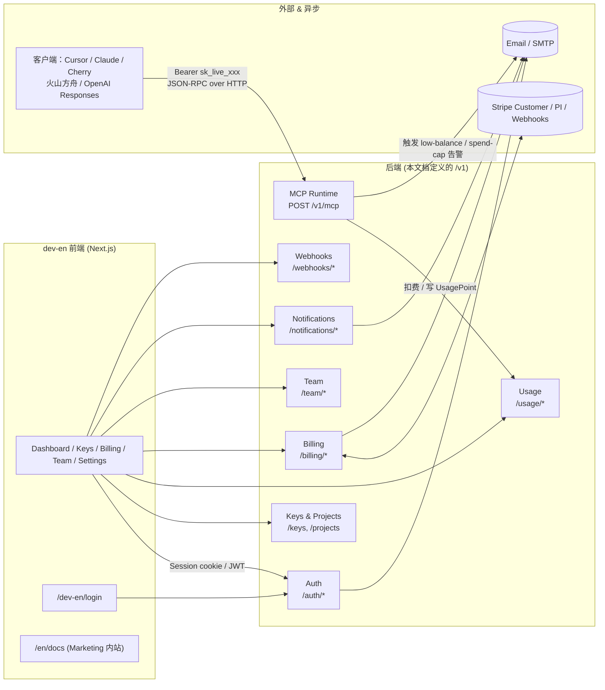
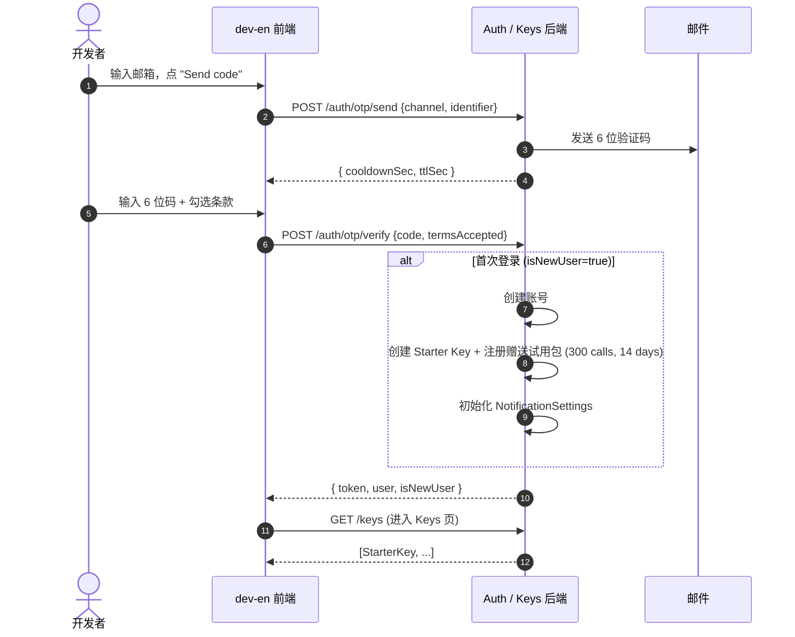
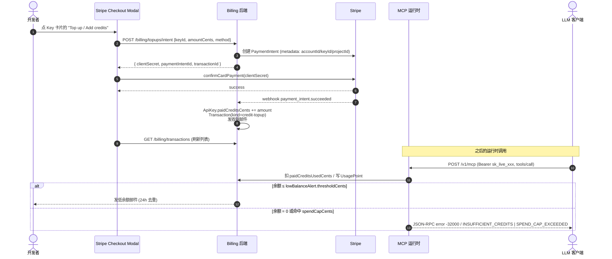
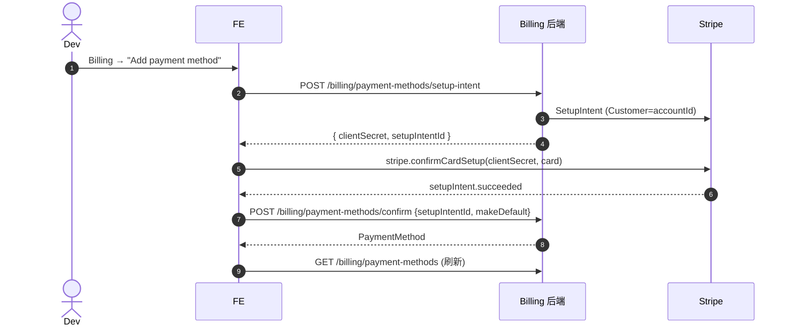
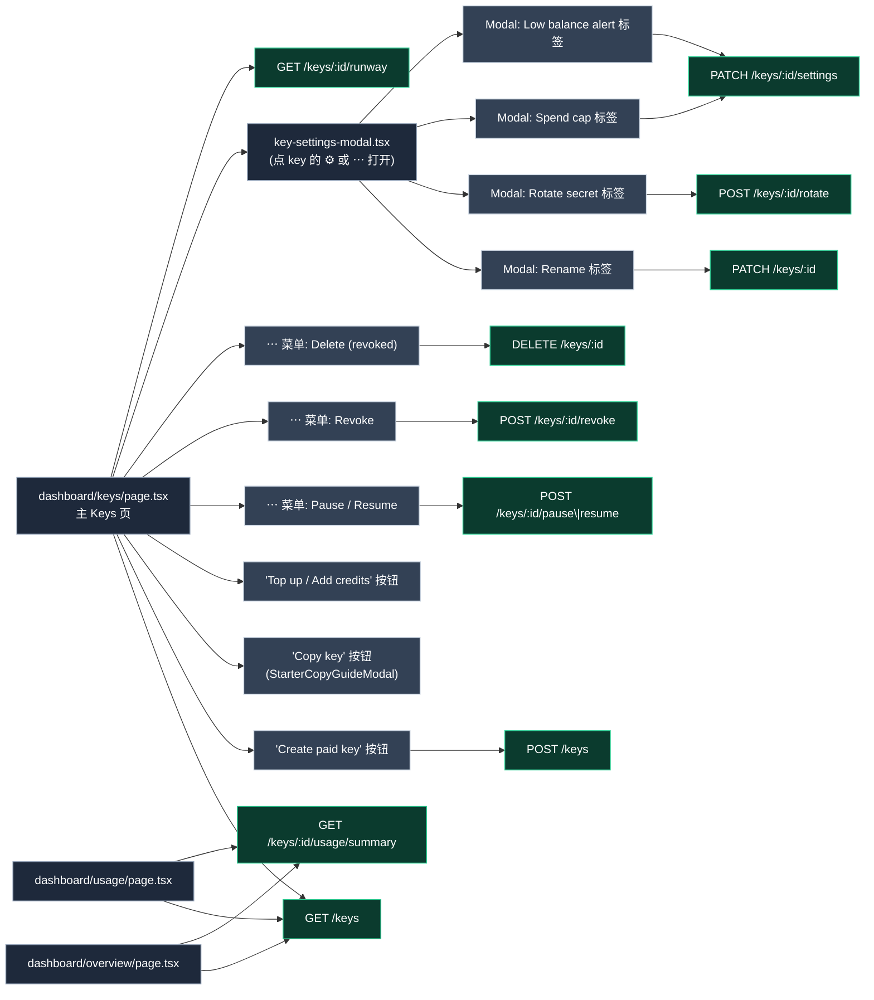

# Chivox MCP 英文开发者控制台 —— 后端接口文档

> 适用范围：`src/app/dev-en` 下的英文 2C 开发者控制台（登录、Dashboard、计费、团队、通知等全部功能）。
> 所有字段、状态、单位均严格对应当前前端 Mock Store：`src/app/dev-en/_lib/mock-store.ts` 与 `src/app/dev-en/_lib/mock-auth.tsx`。
> 本文可直接作为前后端对接契约 v0。
>
> 下列 Mermaid 图在 GitHub、Cursor 内置 Markdown Preview、VSCode Markdown Preview Mermaid Support 扩展中均能直接渲染。如需导出静态图，推荐用 [mermaid.live](https://mermaid.live) 粘贴源码导出 SVG/PNG。
>
> **UI 截图**：每个模块的速查表下方都预埋了 `` 引用，指向 `docs/images/dev-en/*.png`。截图命名与抓取重点见 [`docs/images/dev-en/README.md`](./images/dev-en/README.md)；图一落盘就会自动在文档里渲染，没有图的位置会显示 broken image + alt 文字，不会影响文档结构。

---

## 导读：先看这三张图

### 图 1 —— 系统拓扑

控制台（本前端）只说 "控制面" 接口；MCP 实际调用走独立的 "运行时" endpoint。Stripe 与邮件服务在后端内部完成，前端不直连。



### 图 2 —— 前端模块 ↔ 后端接口映射（按左侧导航顺序）

这是 "读完立刻知道该修哪个接口" 的那张图。每个前端文件下面列出它会命中的所有 endpoint（星号 `*` 表示该页是主要调用方，其它页面只是顺带读）。

```mermaid
flowchart LR
  classDef page fill:#1e293b,stroke:#94a3b8,color:#ffffff,stroke-width:1.2px;
  classDef api fill:#0b3b2e,stroke:#34d399,color:#ffffff,stroke-width:1.2px;
  classDef note fill:#422006,stroke:#fbbf24,color:#fef3c7,stroke-width:1.2px;

  L["login/page.tsx<br/>oauth-buttons.tsx"]:::page
  OV["dashboard/overview"]:::page
  KS["dashboard/keys/page.tsx<br/>+ key-settings-modal"]:::page
  US["dashboard/usage"]:::page
  BL["dashboard/billing/*"]:::page
  RH["dashboard/recharge-history"]:::page
  TM["dashboard/team"]:::page
  ST["dashboard/settings<br/>(profile, members, notif)"]:::page
  STR["stripe-checkout-modal.tsx<br/>(从 Keys / Billing 唤起)"]:::page

  A1["POST /auth/otp/send"]:::api
  A2["POST /auth/otp/verify"]:::api
  A3["GET  /auth/oauth/:provider/*"]:::api
  A4["GET  /auth/me"]:::api
  A5["PATCH /auth/me"]:::api
  A6["POST /auth/logout"]:::api

  P1["GET /projects"]:::api
  P2["POST /projects"]:::api

  K1["GET /keys"]:::api
  K2["POST /keys"]:::api
  K3["PATCH /keys/:id"]:::api
  K4["POST /keys/:id/rotate"]:::api
  K5["POST /keys/:id/pause|resume"]:::api
  K6["POST /keys/:id/revoke"]:::api
  K7["DELETE /keys/:id"]:::api
  K8["PATCH /keys/:id/settings"]:::api
  K9["GET /keys/:id/usage/summary"]:::api
  K10["GET /keys/:id/runway"]:::api

  U1["GET /usage/points"]:::api
  U2["GET /usage/account-summary"]:::api
  U3["GET /usage/export.csv"]:::api

  B1["GET /billing/pricing"]:::api
  B2["GET|PUT /billing/spend-limit"]:::api
  B3["GET /billing/payment-methods"]:::api
  B4["POST /billing/payment-methods/setup-intent"]:::api
  B5["POST /billing/payment-methods/confirm"]:::api
  B6["POST /billing/payment-methods/:id/default"]:::api
  B7["DELETE /billing/payment-methods/:id"]:::api
  B8["POST /billing/topups/intent"]:::api
  B9["POST /billing/topups/:id/confirm"]:::api
  B10["GET /billing/transactions"]:::api
  B11["GET /billing/invoices/:n.pdf"]:::api

  T1["GET /team/members"]:::api
  T2["POST /team/members/invite"]:::api
  T3["POST /team/members/:id/resend"]:::api
  T4["PATCH /team/members/:id"]:::api
  T5["DELETE /team/members/:id"]:::api

  N1["GET|PATCH /notifications/settings"]:::api
  H1["GET|POST|DELETE /webhooks/endpoints*"]:::api

  L --> A1 & A2 & A3
  OV --> A4 & U2 & K1 & U1 & B2 & B10
  KS --> K1 & K2 & K3 & K4 & K5 & K6 & K7 & K8 & K9 & K10 & P1 & P2
  US --> U1 & U2 & U3 & K1
  BL --> B1 & B2 & B3 & B4 & B5 & B6 & B7 & B10 & B11 & U2
  RH --> B10 & B11
  TM --> T1 & T2 & T3 & T4 & T5
  ST --> A4 & A5 & A6 & N1 & T1 & H1
  STR --> B3 & B4 & B5 & B8 & B9
```



### 图 3 —— 三条最关键的业务流程时序

#### 3a. 首次登录（OTP）→ 自动发 Starter Key



#### 3b. 给某个 Key 充值 → MCP 扣费 → 告警

实线是同步调用，虚线是 Stripe webhook 触发的异步流。



#### 3c. 绑卡（SetupIntent）



### 图 4 —— 关键数据结构之间的引用关系

看字段/外键时用这张；详细字段在 §3 / §5 / §6 里。

```mermaid
classDiagram
  class Account {
    id
    stripeCustomerId
    createdAt
  }
  class User {
    id
    name
    email
    avatarUrl
    method (email/google/github/microsoft)
  }
  class Project {
    id
    slug
    name
  }
  class ApiKey {
    id
    env (dev/prod)
    isStarter
    status (active/paused/revoked)
    trialTotalLimit / trialTotalUsed
    trialGrantedAt / trialExpiresAt
    paidCreditsCents / paidCreditsUsedCents
    spendCapCents
    lowBalanceAlert
  }
  class UsagePoint {
    date (UTC)
    keyId
    calls
    costCents
    savingsCents
  }
  class Transaction {
    id
    amountCents
    status
    method
    kind (credit-topup/card-added)
    invoiceNumber
  }
  class PaymentMethod {
    id
    brand / last4
    isDefault
  }
  class TeamMember {
    role (owner/admin/developer/viewer)
    status (active/invited)
  }

--- PART 2 ---
  class NotificationSettings {
    weeklyUsageReport
    paymentReceipts
    spendLimitAlerts
    lowBalanceAlertsMaster
    ...
  }

  Account "1" --> "*" User
  Account "1" --> "*" Project
  Account "1" --> "*" TeamMember
  Account "1" --> "1" NotificationSettings
  Account "1" --> "*" PaymentMethod
  Project "1" --> "*" ApiKey
  ApiKey "1" --> "*" UsagePoint
  ApiKey "1" --> "*" Transaction : keyId (topup)
  PaymentMethod "1" --> "*" Transaction : method
```

---

## 0. 通用约定

- **BaseURL**：建议 `https://api.chivoxmcp.com/v1`
- **鉴权**：
  - 控制台接口：会话 Token（`Cookie: session=...` 或 `Authorization: Bearer <jwt>`）
  - MCP 运行时接口：`Authorization: Bearer sk_live_xxx / sk_test_xxx`
- **内容类型**：`application/json; charset=utf-8`
- **时间**：所有 `*At` 字段使用 ISO 8601（UTC）；`date` 字段格式 `YYYY-MM-DD`（UTC）
- **金额**：一律使用 **cents**（整数），前端再格式化为 USD
- **分页**：列表接口统一 `?page=1&pageSize=20`，返回 `{ items, total, page, pageSize }`
- **错误结构**：
  ```json
  { "error": { "code": "INVALID_REQUEST", "message": "…", "field": "email" } }
  ```
- **幂等**：涉及金钱/建资源的 POST 接受 `Idempotency-Key` 头

---

## 0.1 计费模型变更清单（必须阅读）

> 版本：`v1.1-calls`（当前前端实现）
> 目标：从“余额（美元）模型”切换到“次数（calls）模型”。

### A. 概念层变更（旧 → 新）

1. **充值含义**
   - 旧：充值增加 `paidCreditsCents`（美元余额）。
   - 新：充值购买调用次数，最终体现在 key 的 `total_limit` 增长（前端展示为 calls remaining）。

2. **Key 可用性判断**
   - 旧：看余额（`paidCreditsCents - paidCreditsUsedCents`）是否 > 0。
   - 新：看次数（`total_limit - total_used`）是否 > 0。

3. **上限字段语义**
   - 旧：`monthly_limit_cents` / `spend_cap_cents` / `threshold_cents` 按美元理解。
   - 新：前端按“次数上限”使用（字段名暂未改，语义已切换，见 TODO）。

4. **充值记录文案**
   - 旧：`Top-up · $xx.xx`。
   - 新：优先展示 `+N calls`（后端有 `calls` 字段时）。

5. **前端成功态策略**
   - 旧：后端失败也可能继续本地显示成功（已修复）。
   - 新：`topups/intent` 或 `topups/:id/confirm` 任一失败即报错，不显示成功，不写本地成功记录。

### B. 接口层变更（重点）

1. `POST /billing/topups/intent`
   - 继续接收 `amount_cents`（后端支付金额）。
   - 前端金额来源改为：`calls -> priceForCalls(calls)` 计算得出。
   - `method` 由前端按实际支付方式传（`card|ach|wire`），不再固定写死 `card`。

2. `POST /billing/topups/:transactionId/confirm`
   - 成功后后端必须写入可查询交易记录（`GET /billing/transactions` 能看到）。
   - 推荐返回里包含 `calls`（便于前端直接展示 `+N calls`）。

3. `GET /billing/transactions`
   - 建议返回：
     - `amount_cents`（支付金额）
     - `calls`（本次购买次数，可选但强烈建议）
     - `kind/status/method/key_id/invoice_number`

### C. 兼容期 TODO（后端字段命名）

当前后端字段名仍含 `*_cents`，但前端语义已按 calls 使用。建议后续重命名：

- `monthly_limit_cents` -> `monthly_limit_calls`
- `spend_cap_cents` -> `spend_cap_calls`
- `threshold_cents` -> `threshold_calls`

---

## 0.2 充值梯度与预设（前后端必须一致）

> 这是当前 UI/价格计算的“单一真相来源”。后端若有活动价或策略变更，需同步更新前端 `src/app/dev-en/_lib/pricing.ts`。

### 阶梯单价（整笔按档位单价，flat）

| 档位 | 购买次数区间 | 单价（USD/次） | 计算方式 |
| --- | --- | --- | --- |
| Tier 1 | 1 - 999 | $0.02 | 总价 = 次数 * 0.02 |
| Tier 2 | 1,000 - 9,999 | $0.015 | 总价 = 次数 * 0.015 |
| Tier 3 | >= 10,000 | $0.01 | 总价 = 次数 * 0.01 |

### 前端预设充值按钮（需明显展示）

- `100`
- `500`
- `1,000`
- `5,000`
- `10,000`
- `50,000`

### 计价示例

- 500 次 -> $10.00（Tier 1）
- 1,000 次 -> $15.00（Tier 2）
- 10,000 次 -> $100.00（Tier 3）

---

## 1. Auth（登录 / 会话）

登录方式四种：`email`（一次性验证码）、`google`、`github`、`microsoft`。
手机号 / 短信 OTP 已从 B2C 流程中移除（欧美开发者对手机号较敏感；企业场景改走 Microsoft Entra）。

### 前端调用方速查

| § | Endpoint | 前端文件 | UI 触发点 |
| --- | --- | --- | --- |
| 1.1 | `POST /auth/otp/send` | `login/page.tsx` | "Send code / 发送验证码" 按钮 |
| 1.2 | `POST /auth/otp/verify` | `login/page.tsx` | "Continue / 继续" 提交按钮 |
| 1.3 | `GET /auth/oauth/{provider}/start\|callback` | `_components/oauth-buttons.tsx` | GitHub / Google / Microsoft 三个按钮 |
| 1.4 | `GET /auth/me` | `_lib/mock-auth.tsx`（全局 hydrate） | 应用首次加载、刷新、登录回跳 |
| 1.5 | `PATCH /auth/me` | `dashboard/profile/page.tsx` | "Save changes / 保存修改"（name / email / avatar） |
| 1.6 | `POST /auth/logout` | `_components/sidebar.tsx` → `UserChip` | 侧栏头像 → "Sign out / 登出" |

<p></p>

### 1.1 发送一次性验证码

`POST /auth/otp/send`

```json
// req
{ "channel": "email", "identifier": "you@x.com" }
// resp
{ "cooldownSec": 30, "ttlSec": 300 }
```

- 30 秒内重发需返回 429，并带 `retryAfterSec`
- 需要接人机验证（前端 `AntiBot` 组件），建议接入 reCAPTCHA / hCaptcha，头 `X-Captcha-Token`
- 目前 `channel` 只有 `email`；`phone` 预留字段位但不在对外契约里启用

### 1.2 校验验证码并登录

`POST /auth/otp/verify`

```json
// req
{ "channel": "email", "identifier": "...", "code": "123456", "termsAccepted": true }
// resp
{ "token": "...", "user": MockUser, "isNewUser": true }
```

首次登录成功时后端需要：创建账号 → **自动下发一把 Starter Key**（见 §3）→ 初始化 Notification 默认值。

### 1.3 OAuth 登录

`GET /auth/oauth/{provider}/start?redirect=...`  →  `GET /auth/oauth/{provider}/callback`

- provider: `google` | `github` | `microsoft`
- 回调成功返回同 1.2 的结构
- Microsoft 使用 Entra ID (v2) common endpoint，覆盖个人 Outlook / 企业工作账号

### 1.4 当前用户

`GET /auth/me`

```ts
MockUser {
  id: string
  name: string
  email: string
  avatarUrl?: string
  method: 'email' | 'google' | 'github' | 'microsoft'
  createdAt: string
}
```

### 1.5 修改资料

`PATCH /auth/me`

```json
{ "name"?: "...", "email"?: "...", "avatarUrl"?: "..." }
```

仅允许上述三个字段。邮箱变更需要二次验证（可返回 `requiresVerification: true`）。

### 1.6 登出

`POST /auth/logout`

---

## 2. Projects（项目）

项目是 API Key 的命名空间（一个项目下多把 key）。当前 UI 里几乎所有提到项目名的地方都需要这两个接口。

### 前端调用方速查

| § | Endpoint | 前端文件 | UI 触发点 |
| --- | --- | --- | --- |
| 2.1 | `GET /projects` | `dashboard/keys/page.tsx`、`dashboard/usage/page.tsx`、`stripe-checkout-modal.tsx` | Keys 页项目分组、Usage 页项目过滤器、充值弹窗的项目选择器 |
| 2.2 | `POST /projects` | `dashboard/keys/page.tsx`（`CreateProjectModal`）、`stripe-checkout-modal.tsx` | Keys 页 "New project / 新建项目"、充值弹窗里 "Create new project" 快捷项 |

### 2.1 列表

`GET /projects` → `Project[]`

```ts
Project { id: string; slug: string; name: string; createdAt: string }
```

### 2.2 创建

`POST /projects`  body `{ "name": "Production API" }` → `Project`

- 后端生成 `slug`（如 `mcp-project-1234567890`）

> 当前 UI 暂未提供改名/删除，可先预留 `PATCH /projects/:id`、`DELETE /projects/:id`。

---

## 3. API Keys（核心）

> 账号模型两层：**Starter Key**（每账号唯一，作为默认 key 自动创建）+ **账户级注册赠送试用包**（默认 300 次，14 天内有效；到期或次数用完即失效）。后续调用统一走账户钱包，可设月度上限与低余额告警。

### 前端调用方速查

这节是全文最多接口的一块，建议配合下面 "图 3.0 页面-按钮-接口流程" 一起看：左边是页面上的按钮，右边是它会命中的 endpoint。



速查表（和上图一一对应）：

| § | Endpoint | 前端文件 | UI 触发点 |
| --- | --- | --- | --- |
| 3.2 | `GET /keys` | `dashboard/keys/page.tsx` | 首次进入 Keys 页；Overview / Usage 页也顺带拉一份做展示 |
| 3.3 | `POST /keys` | `dashboard/keys/page.tsx` | "Create paid key / 创建付费 Key" 绿色按钮（走 `NewKeyRevealModal` 一次性展示明文 secret） |
| 3.4 | `PATCH /keys/:id` | `_components/key-settings-modal.tsx` | 齿轮弹窗 → Rename 标签页 → "Save" |
| 3.5 | `POST /keys/:id/rotate` | `_components/key-settings-modal.tsx` | 齿轮弹窗 → Rotate 标签页 → "Rotate secret"（成功后再次弹 `NewKeyRevealModal`） |
| 3.6 | `POST /keys/:id/pause` / `.../resume` | `dashboard/keys/page.tsx` | key 卡片右上 ⋯ 菜单 → "Pause" / "Resume" |
| 3.7 | `POST /keys/:id/revoke` | `dashboard/keys/page.tsx` | ⋯ 菜单 → "Revoke"（确认对话框） |
| 3.8 | `DELETE /keys/:id` | `dashboard/keys/page.tsx` | Revoked 分组下每条的 "Delete permanently"（仅 revoked 可见） |
| 3.9 | `PATCH /keys/:id/settings` | `_components/key-settings-modal.tsx` | 齿轮弹窗 → Spend cap / Low-balance alert 两个标签页 |
| 3.10 | `GET /keys/:id/usage/summary` | `dashboard/keys/page.tsx` 的 `PaidKeyCard`、`dashboard/overview/page.tsx`（最活跃付费 key 区块）、`dashboard/usage/page.tsx` | 每个 paid key 卡片的 "Lifetime calls" 数字 |
| 3.11 | `GET /keys/:id/runway?additionalCents=0` | `dashboard/keys/page.tsx`（`CreditRunway` 子组件）、`stripe-checkout-modal.tsx` | paid key 卡片的 "≈ X days runway" 文案；充值弹窗的 "after top-up: ≈ Y days" 预览 |

> 关于 Starter 充值：在前端里 "Top up / Add credits" 按钮对 Starter 和 Paid 是同一个入口（`stripe-checkout-modal.tsx` 的 `mode='add-credits'`），最终都落到 §5.4 `POST /billing/topups/intent` —— 本节接口里没有 "给 key 充值" 这一个 endpoint，别找。

<p></p>
<p></p>
<p></p>

### 3.1 ApiKey 数据结构

```ts
ApiKey {
  id: string
  name: string
  env: 'development' | 'production'
  projectId: string
  secret: string             // 完整明文，仅创建/轮换后响应一次
  maskedSecret: string       // sk_live_xxxx••••••••••••••••abcd
  createdAt: string
  lastUsedAt: string | null
  status: 'active' | 'paused' | 'revoked'
  isStarter: boolean
  // 兼容旧字段：当前试用包没有 daily cap，前端不再依赖这些字段
  freeDailyLimit: number
  freeDailyUsed: number
  freeDailyResetAt: string
  freeTotalLimit: number
  freeTotalUsed: number
