# 词句刷刷刷小程序测试用例

> 生成日期：2026-06-26  
> 依据：`app.json` 路由、`README.md` 功能说明、`docs/mini-app-tech-doc.html` 页面/接口清单、`mockups/*.html` 与页面 `wxml/js` 交互入口。  
> 截图来源：已运行 `node scripts/capture-mini-app-screenshots.mjs --only=home-list,practice,listen,quiz,checkin,me,plan,report,membership,exam,study-record`，输出在 `docs/images/mini-app/`。

## 一、截图索引

| 功能域 | 截图 | 覆盖页面/状态 |
| --- | --- | --- |
| 新手引导 | 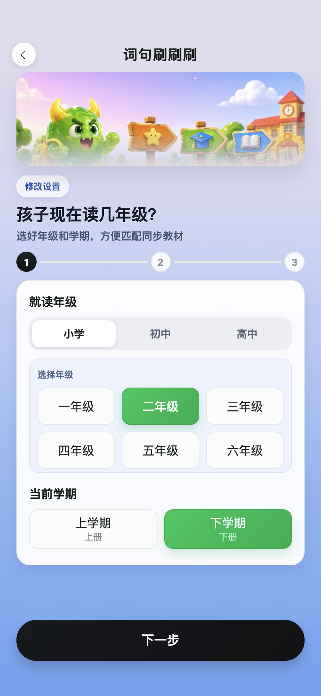 | `pages/onboarding/onboarding` 首访配置流程 |
| 今日路线 | 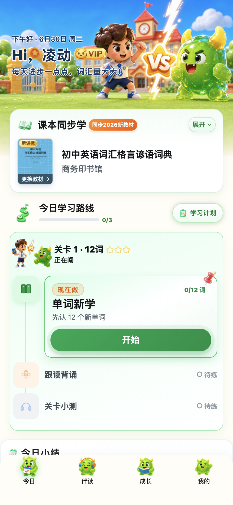 | `pages/today/today` 今日任务、入门测提示、会员浮层 |
| 成长列表 | 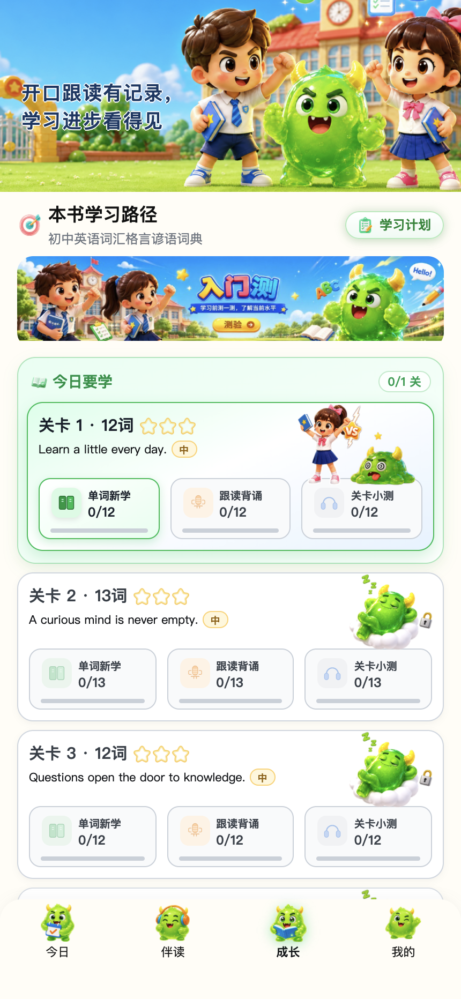 | `pages/home/home` 列表闯关、报告入口、任务入口 |
| 成长地图 | 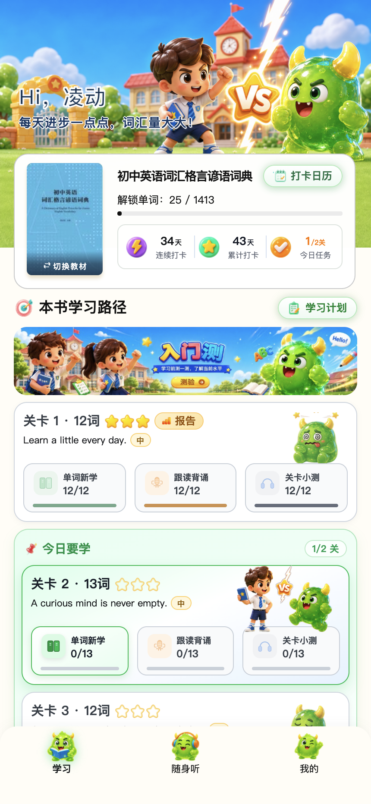 | `pages/home/home` 地图闯关 |
| 教材选择 | 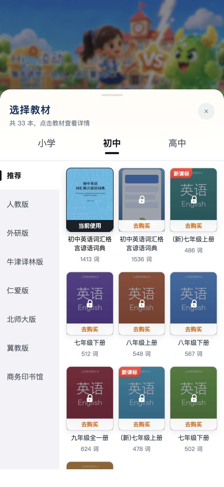 | 教材切换弹窗、学段/版本筛选 |
| 单词新学 | 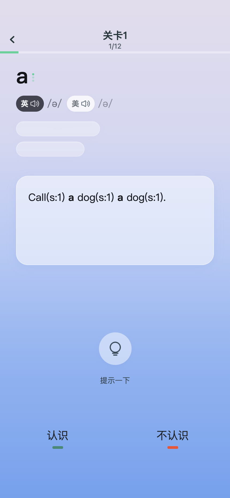 | `pages/practice/practice?taskType=word` |
| 跟读背诵 | 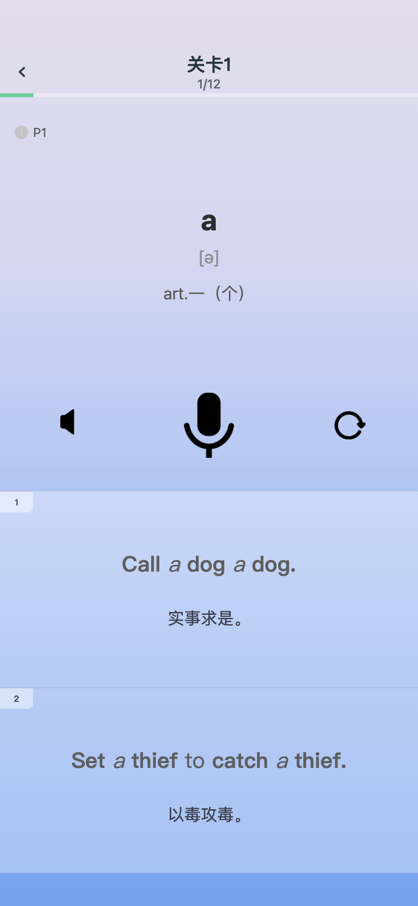 | `pages/practice/practice?taskType=recitation` |
| 随身听 | 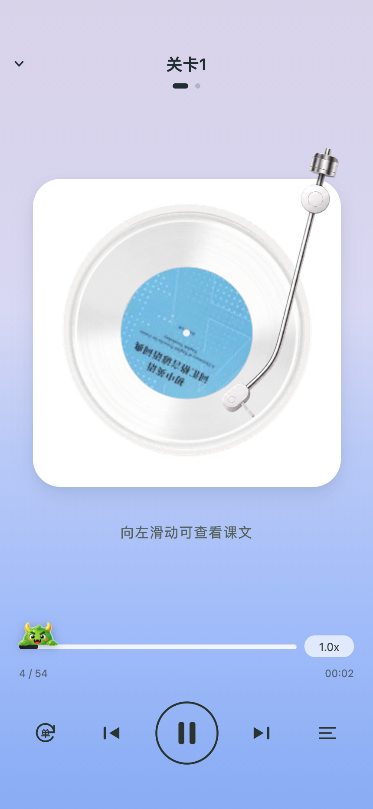 | `pages/listen/listen` 播放器 |
| 关卡小测 | 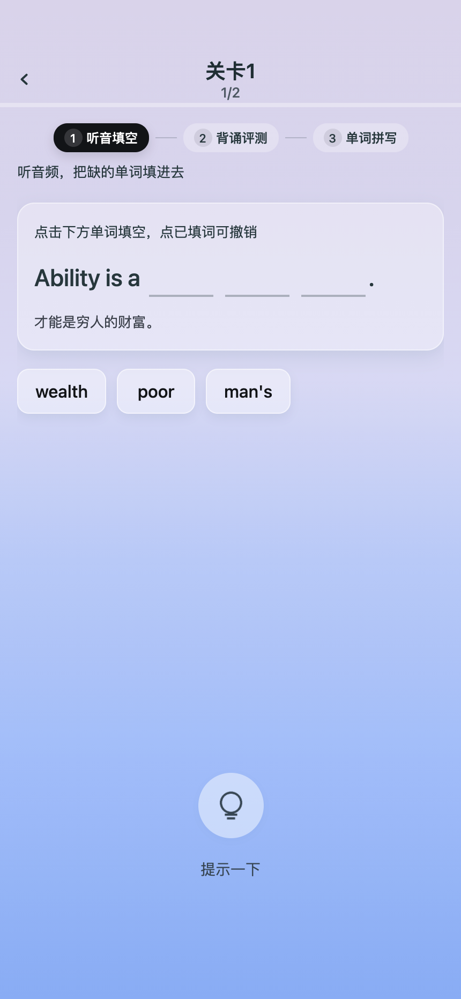 | `pages/listen/listen?mode=quiz` 听音填空/背诵/拼写 |
| 打卡日历 | 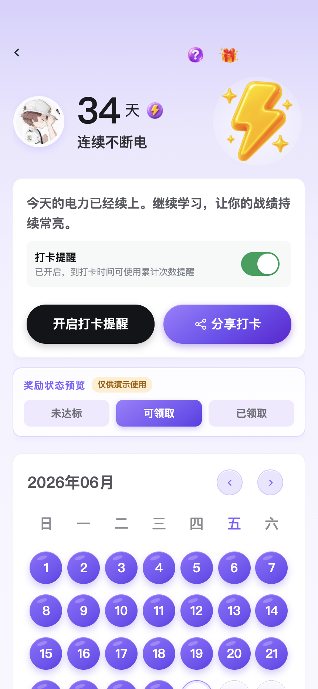 | `pages/checkin/calendar` 日历、提醒、礼品、分享 |
| 学习计划 | 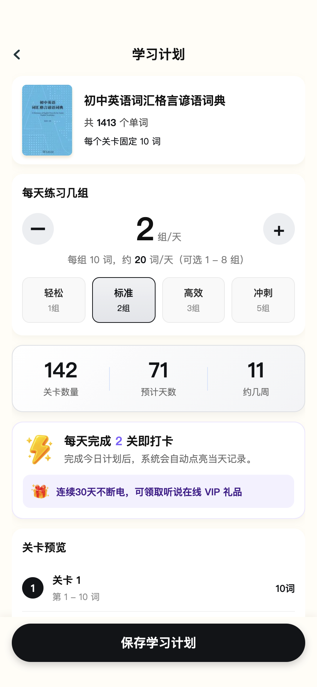 | `pages/plan/plan` 每日组数、预览、保存 |
| 完成页-单词 | 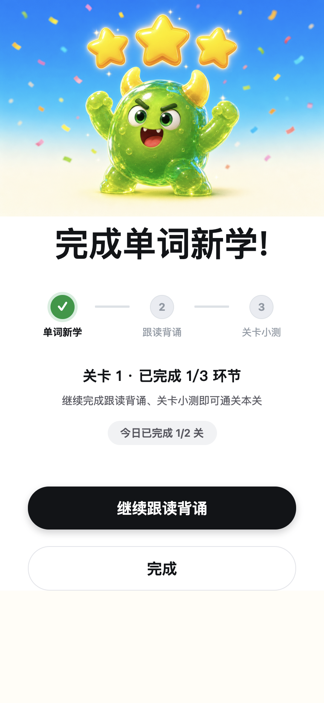 | `pages/finish/today?taskType=word` |
| 完成页-跟读 |  | `pages/finish/today?taskType=recitation` |
| 完成页-小测 | 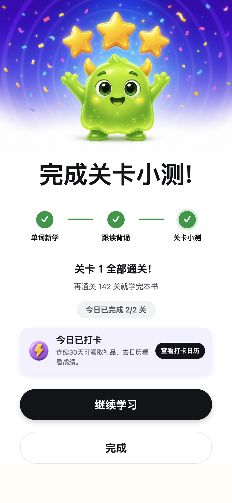 | `pages/finish/today?taskType=listening` |
| 今日完成/打卡 |  | 今日完成、打卡卡片 |
| 会员 | 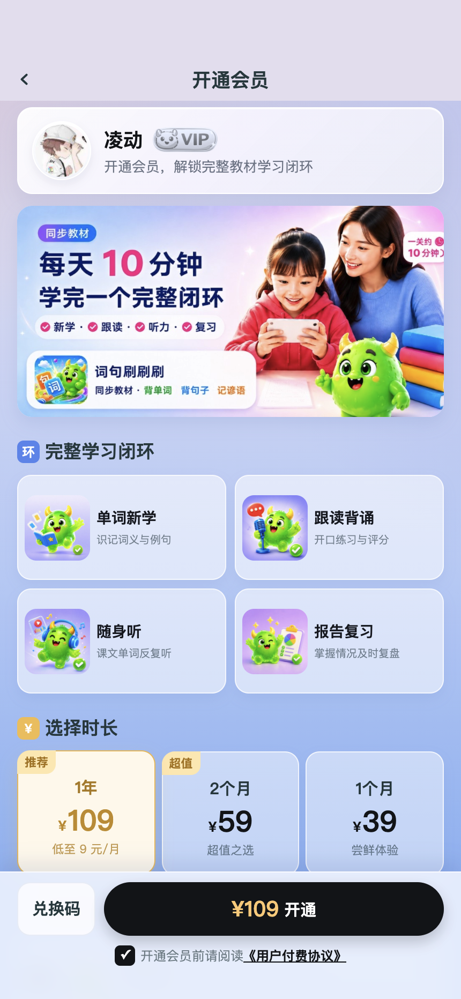 | `pages/membership/membership` 套餐、兑换码、协议、确认 |
| 会员预览旧图 | 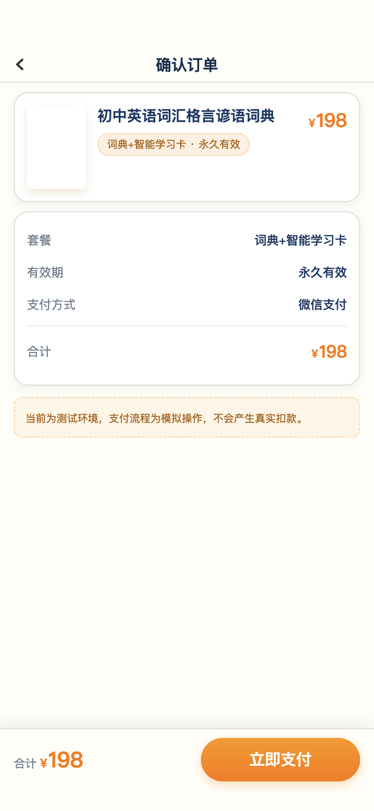 | 会员权益说明旧截图 |
| 商品详情旧图 | 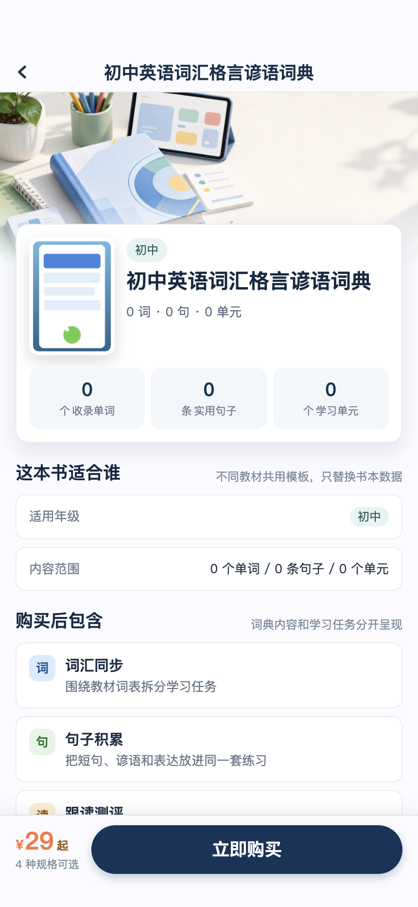 | 已下线商品详情/销售说明参考 |
| 我的 | 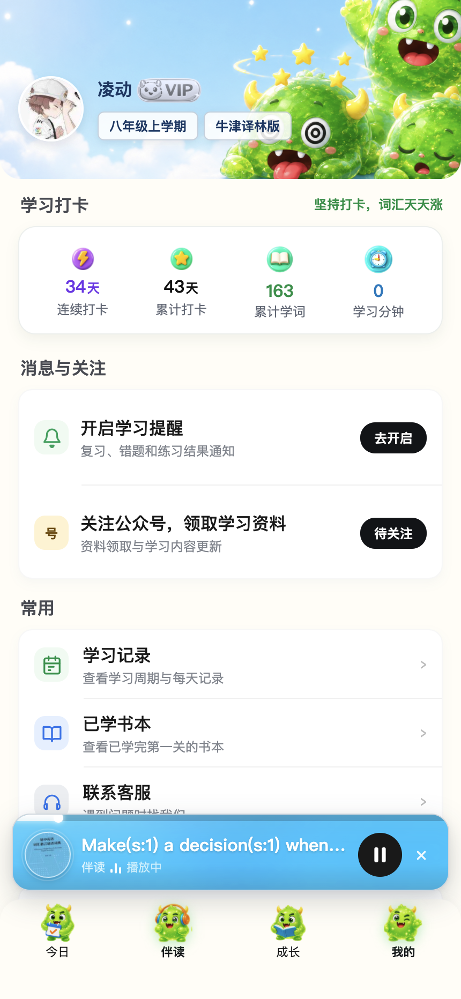 | `pages/me/me` 资料、会员、学习统计、入口 |
| 已学教材 |  | `pages/me/book` 已学书本、继续学习/切换 |
| 入门测 | 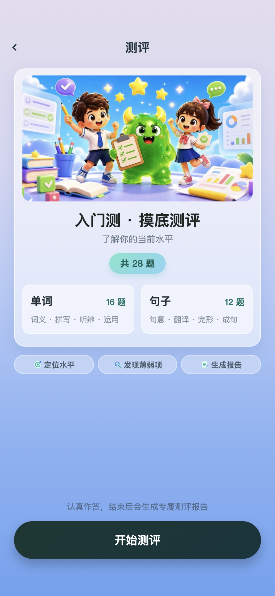 | `pages/exam/exam` 测评答题 |
| 测评报告 | 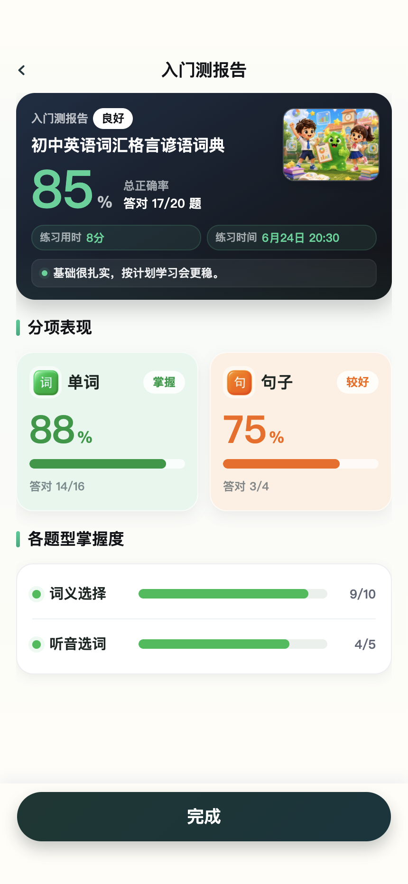 | `pages/exam/exam-report` |
| 关卡报告 | 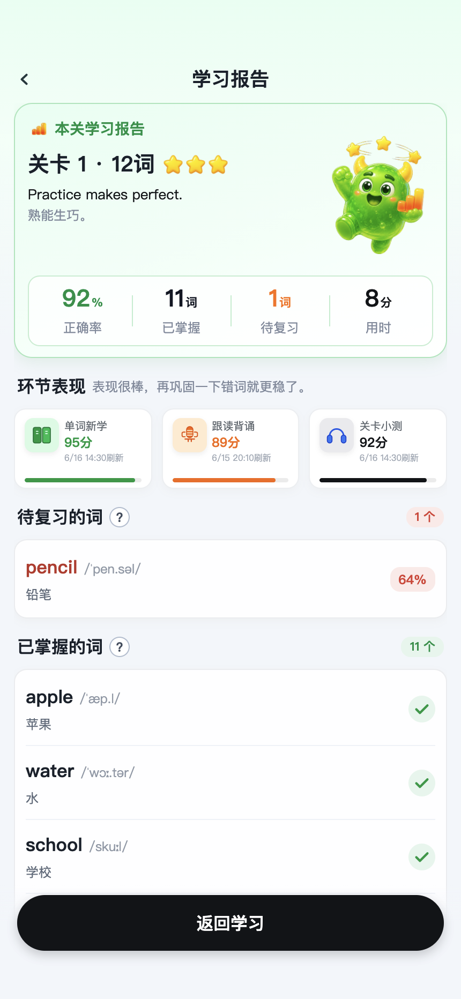 | `pages/report/report` |
| 学习记录 | 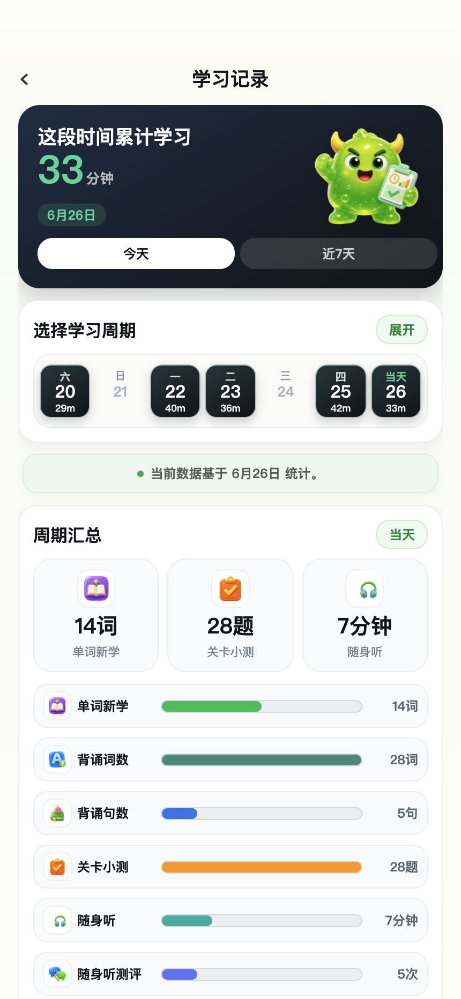 | `pages/study-record/record` |

## 二、测试前置条件

| 项 | 建议设置 |
| --- | --- |
| 运行环境 | 微信开发者工具，基础库不低于项目配置；开启 CLI/服务端口以复跑截图 |
| 数据状态 | 默认 Mock 或联调测试账号；至少有一本可用教材、一个已解锁第 1 关、一个会员锁关卡 |
| 权限状态 | 分别覆盖未授权/已授权：用户资料、手机号、麦克风、订阅消息、相册保存 |
| 网络状态 | 正常网络、接口失败/超时、音频资源失败三类 |
| 会员状态 | 非会员、会员有效、兑换码开通、订单记录为空/非空 |
| 学习状态 | 新用户无计划、已保存计划、已完成部分环节、全关完成、有错词 |

## 三、P0 主链路用例

| ID | 功能/页面 | 用例目标 | 前置条件 | 操作步骤 | 预期结果 |
| --- | --- | --- | --- | --- | --- |
| TC-P0-001 | 新手引导 | 首访完成档案配置并进入今日页 | 新账号，无学生档案 | 进入小程序；依次选择学段/年级、学期、教材版本、学习形象；手机号跳过或授权；点击完成 | 档案保存成功，进入 `pages/today/today`；默认教材与所选年级/学期匹配；无必填项缺失时才可完成 |
| TC-P0-002 | 新手引导 | 必填项校验 | 新账号 | 不选择学期/年级/教材/形象，直接下一步或完成 | 出现对应 toast；页面停留在当前步骤；已选内容不丢失 |
| TC-P0-003 | 今日 | 查看今日路线并进入单词新学 | 已有默认教材和学习计划 | 打开今日页；点击待练关卡的“单词新学”任务 | 跳转 `pages/practice/practice?taskType=word`；关卡、教材参数正确；会员锁/进度锁任务不可误进入 |
| TC-P0-004 | 今日 | 已完成环节再练确认 | 单词新学已完成，配置为不忽略提醒 | 点击已完成的单词新学任务 | 弹出再练确认；取消后留在今日页；确认后进入对应练习；“不再提醒”状态生效 |
| TC-P0-005 | 成长 | 列表视图进入三环节 | 有至少 1 个解锁关卡 | 在成长页列表中分别点击单词新学、跟读背诵、关卡小测 | 分别跳转到 practice word、practice recitation、listen quiz；参数包含 `resBookId/unitId/name/taskType/mode` |
| TC-P0-006 | 成长 | 地图视图关卡入口与锁态 | 有已完成、待练、会员锁关卡 | 切换地图视图；点击不同状态关卡和任务按钮 | 已完成显示报告/复习入口；待练可进入任务；会员锁提示开通会员；进度锁提示先完成前序 |
| TC-P0-007 | 单词新学 | “认识/不认识”主流程 | 进入第 1 关单词新学 | 点击音标音频；点击认识；完成选择题；切换详情 Tab；下一词 | 音频可播；认识进入理解验证；答题后显示正误反馈；详情 Tab 文案完整；进度条推进 |
| TC-P0-008 | 单词新学 | 不认识进入详情学习 | 进入单词新学 | 点击不认识；查看例句/近义词/联想/词根/技巧；点击继续 | 进入详情页；所有可用字段渲染；空字段不留异常占位；继续后进入下一词或完成页 |
| TC-P0-009 | 跟读背诵 | 标准音播放与录音评分 | 麦克风已授权 | 进入跟读背诵；播放单词/句子标准音；点击录音；结束录音 | 播放期间全局播放器暂停；录音波形显示；评分完成后展示分数/反馈；进度推进 |
| TC-P0-010 | 跟读背诵 | 麦克风未授权引导 | 麦克风未授权或曾拒绝 | 点击录音 | 出现用途说明或去设置弹窗；授权成功后可录音；拒绝后不崩溃并停留当前题 |
| TC-P0-011 | 随身听 | 播放器基础控制 | 关卡有音频素材 | 进入随身听；点击播放/暂停、上一首/下一首、倍速、循环、进度拖动、播放列表 | 播放状态、标题、进度、倍速、循环态正确更新；列表切换关卡后音频源更新 |
| TC-P0-012 | 关卡小测 | 听音填空流程 | 小测题含 fill | 播放音频；点击空格；选择候选词；清空；重新作答；等待/跳过倒计时 | 填空顺序正确；清空后恢复候选；正误进入下一阶段；倒计时可暂停/跳过 |
| TC-P0-013 | 关卡小测 | 背诵评测流程 | 小测题含 recite | 进入背诵评测；听标准音；录音评分 | 分数写入当前题记录；评分失败有兜底提示；完成后进入拼写或下一题 |
| TC-P0-014 | 关卡小测 | 单词拼写流程 | 小测题含 spell | 播放单词音频；选择字母块；验证正误 | 单空选完即判分；正确/错误态明显；记录 `spellCorrect`；可进入下一题或提交 |
| TC-P0-015 | 完成页 | 三环节完成与打卡 | 完成小测并跳转 finish | 查看完成页；点击查看打卡日历；点击完成/继续 | 单词/跟读完成不误记全关打卡；小测完成后计入今日完成；跳转目标正确 |
| TC-P0-016 | 报告 | 查看关卡学习报告 | 关卡已完成或带报告参数 | 从成长/今日报告入口进入 | 展示掌握词、待复习、环节得分、规则说明；“?” 弹窗可开关；返回学习跳转正确 |
| TC-P0-017 | 打卡日历 | 日历、提醒、分享主流程 | 有学习记录 | 进入打卡日历；切换月份；打开规则；订阅提醒；打开分享海报；切换今日/累计；保存图片 | 日期状态、连续天数、奖励进度正确；订阅成功/拒绝均有反馈；海报生成和保存权限处理正确 |
| TC-P0-018 | 学习计划 | 保存每日目标 | 有教材和关卡 | 调整每日组数；点预设；展开/收起关卡；保存计划 | 预计天数、每日词数、关卡预览实时更新；保存后返回今日页并显示计划更新反馈 |
| TC-P0-019 | 会员 | 非会员开通会员 | 非会员，协议未勾选 | 选择套餐；不勾协议点击开通；勾选协议；确认支付 | 未勾协议时 toast；确认面板套餐/金额正确；模拟支付成功后跳转成功页并刷新会员态 |
| TC-P0-020 | 会员 | 兑换码开通 | 非会员，有有效/无效兑换码 | 输入无效码点击使用；输入有效码；确认开通 | 无效码提示；有效码锁定对应套餐；开通成功后生成订单记录 |
| TC-P0-021 | 我的 | 登录资料与入口导航 | 未登录/已登录各一次 | 点击头像/昵称授权；编辑昵称；选择头像；点击打卡统计、消息授权、公众号、学习记录、教材、协议、客服 | 用户信息保存；手机号脱敏；各入口跳转正确；客服 open-type 可触发 |
| TC-P0-022 | 测评 | 入门测答题并生成报告 | 词书有可用 exam paper | 进入入门测；开始答题；选择题/拼写题作答；上一题；交卷 | 未作答不能下一题；交卷二次确认；结果保存；跳转 `exam-report` 并展示分档文案 |
| TC-P0-023 | 学习记录 | 查看日期统计和报告入口 | 有多日学习记录 | 切换预设日期；展开日历；切换月份；展开某日记录；进入详情报告 | 统计头、每日列表、环节详情一致；无记录日期显示空态；报告入口参数正确 |

## 四、P1 页面与异常用例

| ID | 功能/页面 | 用例目标 | 操作步骤 | 预期结果 |
| --- | --- | --- | --- | --- |
| TC-P1-001 | 教材选择 | 学段/版本筛选与切换 | 在成长页打开教材弹窗；切换小学/初中/高中；切换版本；点击使用 | 列表按条件刷新；当前教材有选中态；切换成功后首页/今日页教材和计划一致 |
| TC-P1-002 | 教材详情/已学书本 | 已学教材列表 | 从我的进入已学书本；点击继续学习/切换教材 | 只展示首关已完成或可学习教材；继续学习回到成长/今日主流程 |
| TC-P1-003 | 会员门禁 | 第 1 关免费，其余会员锁 | 非会员点击第 1 关与第 2 关随身听/小测 | 第 1 关可体验；第 2 关及复习关提示会员解锁 |
| TC-P1-004 | 会员记录 | 订单记录复制 | 开通会员后进入购买记录；点击订单号 | 订单号复制成功；空记录显示空态图和引导 |
| TC-P1-005 | 会员成功页 | 成功页跳转 | 完成开通后点击“查看购买记录”“返回今日学习” | 分别跳转记录页和今日 Tab；会员有效期展示正确 |
| TC-P1-006 | 消息授权 | 三类模板预览与订阅 | 进入 `pages/me/notify`；点击模板卡片、开启提醒、开关偏好、管理微信授权 | 预览弹窗内容正确；订阅成功/拒绝/系统不支持均有反馈；偏好开关本地/后端同步 |
| TC-P1-007 | 隐私协议 | 静态协议与通知入口 | 进入隐私与协议；滚动阅读；点击管理通知授权 | 文案完整无遮挡；跳转 notify |
| TC-P1-008 | 联系客服 | FAQ 与客服按钮 | 进入联系我们；点击联系客服、消息授权状态 | 客服按钮可用；消息授权状态跳转 notify |
| TC-P1-009 | 公众号 web-view | URL 参数渲染 | 从我的公众号入口进入；传入合法/缺失 URL | 合法 URL 打开 web-view；缺失或非法 URL 给出兜底提示 |
| TC-P1-010 | 打卡礼品 | 礼品领取/复制兑换码 | 打开礼品弹窗；未达标/达标/已领取分别操作 | 未达标显示继续打卡；达标可领取或复制码；已领取状态不可重复领取 |
| TC-P1-011 | 分享海报 | 保存权限异常 | 相册未授权/拒绝后点击保存 | 提示去设置或保存失败；弹窗不关闭；重新授权后可保存 |
| TC-P1-012 | 音频异常 | 音频资源缺失或加载失败 | 断网或替换为无效音频后播放单词/随身听/小测音频 | 出现 toast 或错误兜底；不会卡死倒计时/录音/播放状态 |
| TC-P1-013 | 接口失败 | `book-units/unit-words/user-info` 失败 | 模拟接口失败进入今日/成长/练习 | 显示加载失败或空态；不白屏；可重试或返回 |
| TC-P1-014 | 复习关 | 错词复习入口 | 有错词池时点击复习任务；无错词时点击复习 | 有错词进入复习练习；无错词显示巩固/空态文案；报告待复习数一致 |
| TC-P1-015 | 入门测提示 | 今日页频控 | 新书无入门测成绩进入今日；点击稍后再说；再次进入 | 首次弹出入门测提示；稍后再说后按频控不重复打扰；开始入门测跳转正确 |
| TC-P1-016 | 结业测 | 成长页结业测 Banner | 已完成足够关卡或满足结业测条件 | 点击结业测 Banner | 进入 `pages/exam/exam?type=exit`；未满足条件时显示锁定说明 |
| TC-P1-017 | 报告规则 | 规则弹窗交互 | 在关卡报告点击两个 “?” | 弹窗内容与掌握/复习规则一致；遮罩和“知道啦”均能关闭 |
| TC-P1-018 | 底栏/迷你播放器 | 跨页播放 | 随身听开始播放后切换今日/成长/我的 | 迷你播放条保持；切回伴读/随身听状态同步；练习录音时播放器暂停 |
| TC-P1-019 | 安全区适配 | 长屏/短屏适配 | 在 iPhone SE、iPhone 15 Pro Max、Android 常见尺寸预览关键页 | 自定义导航、底栏、按钮不遮挡；弹窗和完成按钮在安全区内 |
| TC-P1-020 | 文案一致性 | 页面术语统一 | 对照 `docs/product-intro-sales.html` 的五步路径和页面文案 | “单词新学 → 跟读背诵 → 关卡小测 → 复习 → 报告”术语一致；不出现旧“广告详情/VIP购买”作为主流程文案 |

## 五、HTML/Mockup 补充验收点

| 来源 | 重点 | 验收点 |
| --- | --- | --- |
| `docs/mini-app-tech-doc.html` | 全站页面清单、接口待接状态、内容导入规则 | 页面职责与测试用例模块一一对应；Mock/待接 API 在验收记录里标注，不把 Mock 成功误判为真实接口已接 |
| `docs/product-intro-sales.html` | 销售版五步学习路径、功能页截图 | 主链路必须覆盖“选教材/定计划/学词/跟读/小测/打卡报告”；销售页引用截图不能缺图 |
| `docs/competitive-comparison.html` | 差异化能力：小程序、教材同步、纠音、报告 | 用例覆盖无需下载 App、按教材单元、驰声纠音、报告闭环这些对外承诺 |
| `onboarding-first-screen-preview.html` | 首屏产品介绍 | 新手引导首屏应表达“同步教材、背单词、背句子、记谚语”，且下一步入口明确 |
| `mockups/word-recite-mockup.html` | 单词新学详情 | 验证认识/不认识、详情 Tab、例句音频、掌握反馈 |
| `mockups/word-spell-mockup.html` | 单词拼写 | 验证候选字母块、听音、单空判分、错误反馈 |
| `mockups/recite-mockup.html` | 跟读/打卡闭环 | 验证完成页打卡、战报和学习统计 |
| `mockups/checkin-share-mockup.html` | 今日/累计分享海报 | 验证海报模式切换、数据口径和保存分享 |
| `mockups/report-entry-mockup.html` | 报告入口位置 | 验证完成关卡才显示报告入口，未完成不打扰 |
| `vip-purchase-preview.html` | 会员购买页 | 验证套餐、权益、免费版对比、购买记录、兑换码确认 |

## 六、回归建议

1. 每次改动学习主链路后，至少回归 `TC-P0-003` 到 `TC-P0-018`。
2. 每次改动会员/锁关逻辑后，至少回归 `TC-P0-019`、`TC-P0-020`、`TC-P1-003`、`TC-P1-004`。
3. 每次改动音频、录音、驰声评分后，至少回归 `TC-P0-009`、`TC-P0-010`、`TC-P0-011`、`TC-P0-013`、`TC-P1-012`、`TC-P1-018`。
4. 每次接入真实后端接口后，对照 `docs/mini-app-tech-doc.html` 页面清单，把相关 Mock 成功用例补跑为真实接口用例。
5. 发布前执行 `npm test` 或 `node --test tests/*.test.js`，再用微信开发者工具手工跑 P0 主链路。
